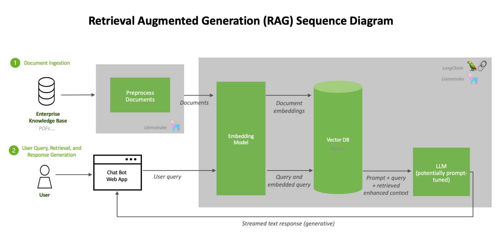

# RAG
Retrieval augmented generation, or RAG, is an architectural approach that can improve the efficacy of large language model (LLM) applications by leveraging custom data. This is done by retrieving data/documents relevant to a question or task and providing them as context for the LLM. RAG has shown success in support chatbots and Q&A systems that need to maintain up-to-date information or access domain-specific knowledge.



# Overview
This project demonstrates the use of a Retrieval-Augmented Generation (RAG) approach to categorize customer support tickets. By integrating a pre-trained language model with a retrieval mechanism, we can enhance the accuracy and contextual relevance of the classification, ultimately improving the support experience.

Here, I've implemented 2 approaches, first, using LLM in the RAG pipeline, as expected from this assignment, and second, using classification model in the RAG pipeline, as an experimentation to simplify the task and solve the problem using less resource hungry model.

# Implementing RAG using LLMs

## Approach
1. **Vector Database Retrieval**: I use a vector database to store and retrieve similar support tickets. This allows me to find relevant examples for each new query. Here, first I use an embedding model to embed the document and then retrieve 3 chunks from the document that are most similar to the query.

2. **LLM-based Classification**: I'm using an LLM, accessed via NVIDIA's endpoint API, to classify the tickets. The model I'm using here is Meta's llama-3.1-8b-instruct. I experimented with various LLMs using HuggingFace Pipeline, but the HuggingFace pipeline was very slow and was resource heavy so wasn't allowing me to bigger models with more than 3B parameters on the available resources.

The LLM is provided with:
   - The query (new support ticket)
   - Retrieved similar tickets and their categories
   - A prompt instructing it to classify the new ticket based on this information

3. **Prompt Engineering**: I've crafted a specific prompt that instructs the LLM to analyze the query in the context of the retrieved tickets and output only the category name and number.

## Rationale
This approach combines the strengths of both retrieval-based and generative AI methods:
- The vector database ensures that the most relevant previous tickets are considered.
- The LLM provides flexibility to understand and categorize tickets even when they don't exactly match previous examples.
- Using NVIDIA's endpoint API allows me to leverage a powerful LLM without the need for local GPU resources.

## Results
Query 1: "There's lag when I'm trying to load the app."

Result: Category 5 - Performance Issues

Time: 0.45 seconds

Query 2: "Cannot find my payment receipt for subscription."

Result: Category 3 - Billing

Time: 0.43 seconds

# Setup
1. Create Environment
    ```
    conda create -n EdLight_RAG python=3.10.14
    conda activate EdLight_RAG
    pip install -r requirements.txt
    ```
2. Before running the jupyter notebook, make sure the EdLight_RAG kernel is selected.
3. Add your NVIDIA api key in the `.env` file. 

**NOTE: For the testing purpose, I've already included my API key for meta/llama-3.1-8b-instruct model. I would appretiate if the API key is kept confidential and not used besides this project.**

# Usage
1. The jupyter notebook to be executed is `main.ipynb`
2. The following parameters can be changed in `main.ipynb`:
    - `VECTOR_DB_DIR` is a `str`: This is the location of the stored vector database.
    - `NUM_RELEVANT_DOCS` is an `int`: Tells the number of documents embedding modal retrieval should output similar to the query.
    - `EMBEDDING_MODEL` is a `str`: This is the embedding model to use to create the vector database.
    - `LLM` is a `str`: This is the LLM model to use to generate the output.
    - `query` is a `str`: This is the support ticket entered by the user.
3. Run the Jupyter Notebook executing the cells in order.

**NOTE: To use a different LLM model, a new NVIDIA API key would be required for that specific model. This can be done from the  [NVIDIA build](https://build.nvidia.com/explore/discover#llama-3_1-8b-instruct) website.**

Embedding models can be used by directly changing the EMBEDDING_MODEL name.

## Shortcomings
1. **Limited Data**: 
   - The system may struggle with new or uncommon types of support tickets.
   - There might be biases towards more frequently occurring ticket types.
   - Tickets could belong to multiple categories, so misclassifications can happen.
   
2. **LLM Consistency and Hallucinations**: Large language models can sometimes produce inconsistent outputs for similar inputs. This inconsistency can lead to:
   - The model can hallucinate and not give the accurate output even after correct classeification. For ex., for the query `I cannot make a payment`, it would classify the ticket correctly, but can give the output as `Category 3 - Payment Issues` instead of `Category 3 - Billing`.
   - Unreliable classifications.
   - Contradictions in categorizations over time.
   - Difficulty in maintaining a stable classification system.
   
   Improvement: Implement ensemble methods or multiple LLM with majority voting. Also, there is a need to regularly monitor the results.

3. **Scalability and Cost**: As the system scales, several challenges arise:
   - Increased retrieval time from the vector database as it grows.
   - Higher API call costs to the NVIDIA endpoint as ticket volume increases.
   
   Improvement: Consider a hybrid approach using simpler models for initial filtering before using the LLM for complex cases.

## Potential Improvements
1. **Multi-lingual Support**: Expanding the system to handle tickets in multiple languages could be beneficial.

2. **Including Explainability**: The model should also give the reason it classfied a ticket to a specific knowledge. THis could help in improving the model overtime as the model starts to misclassify.

# Experimentation
## Models
I experimented with a few models, both for LLM and embedding model to select the best models for the task. The models not only have to be accurate, but also fast.

### Embedding Models
Embedding model was primarily selected on the basis of time it took for the model to create the vector database. Almost all the models I experimented with worked well in retrieving the right chunks from the documents, but varied a lot in terms of time and efficiency.

| Model                                | Avg Time (sec) |
|--------------------------------------|----------------|
| all-MiniLM-L6-v2                     | 17.50          |
| stsb-distilbert-base                 | 48.37          |
| all-MiniLM-L12-v2                    | 30.28          |
| multi-qa-MiniLM-L6-cos-v1            | 16.02          |
| paraphrase-albert-small-v2           | 36.49          |
| paraphrase-MiniLM-L3-v2              | 9.17           |
| distiluse-base-multilingual-cased-v2 | 56.03          |

### LLMs
I used HuggingFace Pipeline to run the LLMs except for the llama-3.1-8b-instruct model which I ran using NVIDIA APIs. This is because, using the available resources, I was not able to use models bigger than 3B parameter, and even the models I ran were performing poorly both in terms of the answer quality and time taken for the output.

| Model                                    | Time      | Inference            |
|------------------------------------------|-----------|----------------------|
| Alibaba-NLP--gte-Qwen2-1.5B-instruct     | 17 min    | HuggineFace Pipeline |
| distilbert--distilgpt2                   | 12 sec    | HuggineFace Pipeline |
| dunzhang--stella_en_1.5B_v5              | 24 min    | HuggineFace Pipeline |
| Meta-Llama-3-8B-Instruct-mntp-supervised | 58 min    | HuggineFace Pipeline |
| Llama-3.1-8b-instruct                    | 0.4 sec   | NVIDIA endpoint API  |

Evidently, Llama-3.1-8b-instruct is the best performing model given the resources it can use to run, i.e. GPUs available with NVIDIA. Also, being the biggest model in terms of parameters, the quality of the answer was the best among all.

## Experimental Classification Approach
Now as mentioned, there are some issues with using LLMs for this application of classifying tickets. The biggest one being the cost is huge to run such models. So, I experimented with a classification model instead of LLM, where in the RAG pipeline, the chunks would be retrieved from the document but would be passed as a query to a classification model instead of LLM. Classification model is much cheaper and reliable for this application.

The classification model accepts the classes, query, and the template for the prompt as parameters, and the facebook/bart-large-mnli model I'm using workes on zero-shot learning, which means does not take any example to learn the task.

There are improvement scopes and limitations in this approach too:
- Using few shot learning, i.e., give the model few examples of the task and then give the task to get better and more informed result.
- Experimentation with different models. The facebook/bart-large-mnli model takes on average 6.5 seconds to give the result.
- The limitation with this approach is that it would require a large dataset which includes hundreds or thousands of examples for the possible tickets an user might raise.

